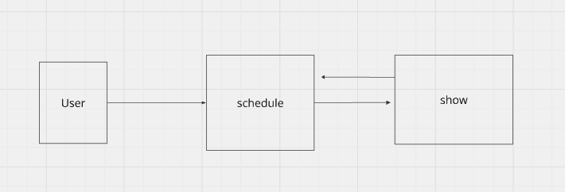

# Salapalooza

## Description
This application is has a functionality focus for admins viewing the details of schedules submitted, the ateendee who created that schedule, and the shows in which they are interested in. Aditionally it allows the admin to edit the users information as needed.

## Flow



## Installation
1. Clone the Repository: [App](https://github.com/wally-yawn/mod_3_final_be).
2. Install Dependencies:
```bundle install```
3. Set up the database: 
```rails db:create```
```rails db:migrate```
```rails db:seed```
4. Start Your rails server: 
```rails server```


### Endpoints

GET /api/v1/schedules
 - Description: Fetches a list of all schedules.
 - Request: 
  Maps to: api/v1/schedules#index

GET /api/v1/users/id/schedules/:id
 - Fetches user-specific schedules details.
 - Maps to: api/v1/user_itineraries#show

DELETE /api/v1/shows/:id
 - Deletes a show by its ID.
 - Maps to: api/v1/shows#destroy 

 ### Links
- [Github FE Repo](https://github.com/kaelinpsalazar/final-music-fe)
- [Github BE Repo](https://github.com/kaelinpsalazar/music_festival_app)

 ### Team Member
#### Kaelin Salazar
- [LinkedIn Profile](https://www.linkedin.com/in/kaelin-salazar/)
- [GitHub Profile](https://github.com/kaelinpsalazar)
